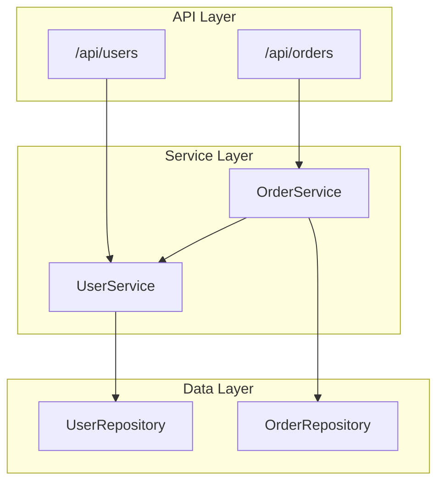
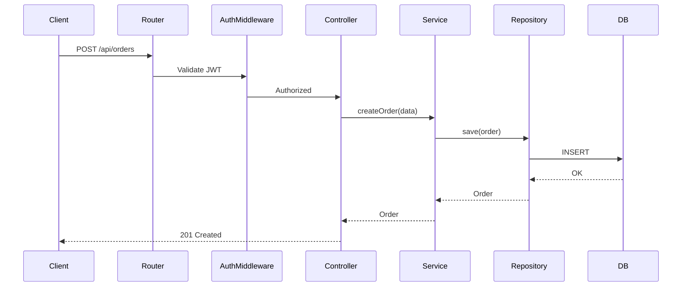

# Cartograph PRD - Architectural Visualization for OpenCode

## Vision

Watch your codebase architecture evolve in real-time as you (or AI) write code. Cartograph provides multiple abstraction levels—from high-level system architecture down to individual file dependencies—updating live as changes happen.

## Problem Statement

Current state: Cartograph shows every file as a node (941 files = overwhelming).

What developers actually want:
- **High-level system architecture** - Services, APIs, layers
- **Flow diagrams** - How data/requests move through the system
- **Design pattern detection** - Recognize MVC, Repository, Factory patterns
- **Real-time evolution** - Watch architecture change as AI writes code

## User Stories

1. **As a developer**, I want to see my system's service layer diagram so I can understand component boundaries without looking at 900+ files.

2. **As a developer**, I want to see API routes grouped with their handlers so I can understand my REST/GraphQL surface area.

3. **As a developer watching AI code**, I want to see architecture diagrams update in real-time so I can verify the AI is following the right patterns.

4. **As a reviewer**, I want Mermaid export so I can include architecture diagrams in PRs and documentation.

## Feature Requirements

### Views (Abstraction Levels)

| View | Description | Granularity |
|------|-------------|-------------|
| **System** | High-level service/package diagram | Packages, modules |
| **Layers** | API → Service → Model → DB | Layer boundaries |
| **Flows** | Request/data flow sequences | Function call chains |
| **Files** | Current view (keep as option) | Individual files |
| **Patterns** | Detected design patterns | Pattern instances |

### View 1: System Architecture

```
┌─────────────────────────────────────────────────────────┐
│                        API Layer                        │
│  ┌──────────┐  ┌──────────┐  ┌──────────┐              │
│  │ /users   │  │ /orders  │  │ /products│              │
│  └────┬─────┘  └────┬─────┘  └────┬─────┘              │
└───────┼─────────────┼─────────────┼─────────────────────┘
        │             │             │
        ▼             ▼             ▼
┌─────────────────────────────────────────────────────────┐
│                     Service Layer                       │
│  ┌──────────┐  ┌──────────┐  ┌──────────┐              │
│  │UserSvc   │  │OrderSvc  │  │ProductSvc│              │
│  └────┬─────┘  └────┬─────┘  └────┬─────┘              │
└───────┼─────────────┼─────────────┼─────────────────────┘
        │             │             │
        ▼             ▼             ▼
┌─────────────────────────────────────────────────────────┐
│                      Data Layer                         │
│  ┌──────────┐  ┌──────────┐  ┌──────────┐              │
│  │UserRepo  │  │OrderRepo │  │ProductRep│              │
│  └──────────┘  └──────────┘  └──────────┘              │
└─────────────────────────────────────────────────────────┘
```

### View 2: Layer Diagram (Mermaid)



### View 3: Flow Diagram

Show request flows through the system:



### View 4: Design Patterns

Detect and visualize common patterns:

| Pattern | Detection Heuristic |
|---------|---------------------|
| Repository | Class with `find*`, `save`, `delete` methods |
| Service | Class injecting repositories, business logic |
| Factory | `create*` methods returning instances |
| Singleton | Private constructor + static instance |
| Observer | `subscribe`, `emit`, `on` methods |
| Middleware | Function signature `(req, res, next)` or `(ctx, next)` |
| Controller | Class with route decorators or handler methods |

### Real-time Updates

- WebSocket pushes diagram updates on file changes
- Highlight recently changed components (glow effect)
- Show "diff" mode: what changed in last N minutes
- Animation: watch components appear/connect as AI creates them

### Export Options

| Format | Use Case |
|--------|----------|
| Mermaid | Embed in GitHub PRs, docs |
| PlantUML | Enterprise tooling |
| PNG/SVG | Presentations |
| JSON | Programmatic access |

## Technical Approach

### Phase 1: View Switching (Week 1)
- Add view selector dropdown (System / Layers / Files)
- Implement package-level grouping for System view
- Collapse files into their parent directories

### Phase 2: Layer Detection (Week 2)
- Enhance analyzer to detect architectural layers
- Heuristics: path patterns (`/api/`, `/services/`, `/models/`)
- Heuristics: naming patterns (`*Controller`, `*Service`, `*Repository`)
- Generate layer-based graph data

### Phase 3: Mermaid Export (Week 3)
- Generate Mermaid syntax from graph data
- Add "Copy Mermaid" button
- Render Mermaid diagrams inline

### Phase 4: Flow Analysis (Week 4)
- Static analysis of function call chains
- Entry points: API routes, event handlers
- Generate sequence diagrams for key flows

### Phase 5: Pattern Detection (Week 5)
- AST-based pattern matching
- Annotate nodes with detected patterns
- Pattern-centric view

## UI/UX Requirements

### View Selector
```
┌─────────────────────────────────────────┐
│ [System ▼]  [Layers]  [Flows]  [Files]  │
└─────────────────────────────────────────┘
```

### Zoom Levels
- Mouse wheel zoom
- Fit-to-screen button
- Focus on selection

### Live Indicator
- Pulsing dot when analysis running
- "Updated 3s ago" timestamp
- Highlight recently changed nodes

### Export Panel
```
┌──────────────────┐
│ Export As...     │
│ ├─ Mermaid       │
│ ├─ PlantUML      │
│ ├─ PNG           │
│ └─ JSON          │
└──────────────────┘
```

## Success Metrics

| Metric | Target |
|--------|--------|
| Initial render time | < 2s for 1000 files |
| Update latency | < 500ms after file change |
| View switch time | < 200ms |
| Export generation | < 1s |

## Open Questions

1. How to handle monorepos with multiple services?
2. Should we detect microservice boundaries automatically?
3. Integration with OpenCode's memory system for pattern learning?

---

## Codebase Modeling

### Entity Extraction

What the analyzer must detect from source code:

#### Structural Entities

| Entity | Detection Method | Attributes |
|--------|------------------|------------|
| **Package/Module** | Directory structure, `package.json`, `go.mod`, `__init__.py` | name, path, dependencies |
| **Class** | AST: `class` declarations | name, methods, properties, inheritance |
| **Interface** | AST: `interface`, `type`, `protocol` | name, methods, implemented_by |
| **Function** | AST: function declarations | name, params, return_type, calls |
| **Type** | AST: type definitions, structs | name, fields, references |
| **Constant/Config** | AST: const declarations, env vars | name, value, usage_count |

#### Behavioral Entities

| Entity | Detection Method | Attributes |
|--------|------------------|------------|
| **API Route** | Decorator patterns (`@Get`, `@Post`), router registrations | method, path, handler, middleware |
| **Event Handler** | `on()`, `subscribe()`, event decorators | event_name, handler, emitters |
| **Middleware** | `(req, res, next)` signature, `use()` calls | name, applies_to, order |
| **Database Query** | ORM calls, SQL strings | table, operation, caller |
| **External Call** | HTTP clients, SDK calls | service, endpoint, caller |

#### Relationship Types

| Relationship | Source → Target | Detection |
|--------------|-----------------|-----------|
| **imports** | File → File | `import`, `require`, `from` |
| **extends** | Class → Class | `extends`, `implements` |
| **calls** | Function → Function | AST call expressions |
| **instantiates** | Function → Class | `new ClassName()` |
| **injects** | Class → Class | Constructor params, decorators |
| **routes_to** | Route → Handler | Router registrations |
| **queries** | Function → Table | ORM/SQL calls |
| **emits** | Function → Event | `emit()`, `publish()` |
| **subscribes** | Function → Event | `on()`, `subscribe()` |

### Semantic Analysis

Beyond syntax, extract meaning:

```typescript
interface SemanticEntity {
  type: 'service' | 'repository' | 'controller' | 'middleware' | 'model' | 'util'
  responsibilities: string[]
  collaborators: string[]
  layer: 'api' | 'service' | 'data' | 'infra' | 'ui'
  boundedContext?: string
}
```

#### Layer Classification Heuristics

| Layer | Path Patterns | Name Patterns | Signature Patterns |
|-------|---------------|---------------|-------------------|
| **API** | `/api/`, `/routes/`, `/handlers/` | `*Controller`, `*Handler`, `*Router` | HTTP method decorators |
| **Service** | `/services/`, `/domain/`, `/business/` | `*Service`, `*UseCase`, `*Manager` | Injected dependencies |
| **Data** | `/repo/`, `/dal/`, `/models/` | `*Repository`, `*DAO`, `*Store` | CRUD method names |
| **Infrastructure** | `/infra/`, `/adapters/`, `/clients/` | `*Client`, `*Adapter`, `*Provider` | External SDK usage |
| **UI** | `/components/`, `/pages/`, `/views/` | `*Component`, `*Page`, `*View` | JSX/template returns |

### Graph Model

```typescript
interface ArchitectureGraph {
  nodes: {
    id: string
    type: 'package' | 'class' | 'function' | 'route' | 'event'
    name: string
    path: string
    layer: string
    pattern?: string
    metrics: {
      loc: number
      complexity: number
      dependencies_in: number
      dependencies_out: number
    }
  }[]
  
  edges: {
    source: string
    target: string
    type: 'imports' | 'calls' | 'extends' | 'injects' | 'routes_to'
    weight?: number
  }[]
  
  clusters: {
    id: string
    name: string
    type: 'layer' | 'domain' | 'package'
    nodes: string[]
  }[]
}
```

---

## Visualization Techniques

### Graph Layouts

| Layout | Best For | Algorithm |
|--------|----------|-----------|
| **Hierarchical** | Layer diagrams, call trees | Dagre, ELK |
| **Force-directed** | Dependency exploration | D3-force, Cola.js |
| **Radial** | Package dependencies | Custom radial |
| **Matrix** | Dependency density | Adjacency matrix |
| **Sankey** | Data flow, request paths | D3-sankey |

### Aggregation Strategies

| Level | Nodes Shown | Edges Shown |
|-------|-------------|-------------|
| **System** | Packages only | Package dependencies |
| **Module** | Packages + key classes | Inheritance + composition |
| **Component** | All classes/functions | All imports |
| **Full** | Everything | Everything |

### Visual Encoding

| Attribute | Visual Property |
|-----------|-----------------|
| Layer | Color (API=blue, Service=green, Data=yellow) |
| Change recency | Glow intensity, border pulse |
| Dependency count | Node size |
| Complexity | Node shape (circle=simple, hexagon=complex) |
| Pattern | Icon badge |

### Interaction Model

```
Click node       → Show details panel
Double-click     → Drill into (expand package)
Hover            → Highlight connections
Ctrl+click       → Multi-select
Right-click      → Context menu (go to file, copy path)
Scroll           → Zoom
Drag background  → Pan
Drag node        → Rearrange (in interactive mode)
```

---

## Navigation System

### Breadcrumb Trail

Always know where you are in the hierarchy:

```
┌─────────────────────────────────────────────────────────────┐
│ 🏠 Root  ›  📦 internal  ›  📦 services  ›  🔷 UserService  │
└─────────────────────────────────────────────────────────────┘
```

- Click any segment to jump to that level
- Shows current drill-down path
- Auto-updates when navigating

### Command Palette (Cmd+K / Ctrl+K)

Quick access to everything:

```
┌─────────────────────────────────────────────────────────────┐
│ 🔍 Search files, functions, routes...                       │
├─────────────────────────────────────────────────────────────┤
│ 📄 UserService.go                           services/       │
│ 📄 user_handlers.go                         api/v1/         │
│ 🔷 CreateUser()                             UserService     │
│ 🌐 POST /api/users                          routes          │
│ 🎯 Repository Pattern                       patterns        │
├─────────────────────────────────────────────────────────────┤
│ Recent                                                      │
│ 📄 agent_execution_engine.go                                │
│ 📄 workflow_service.go                                      │
└─────────────────────────────────────────────────────────────┘
```

### Filter Panel

Narrow down what's visible:

```
┌─────────────────────────────┐
│ Filters                     │
├─────────────────────────────┤
│ Layers                      │
│ ☑ API / Routes              │
│ ☑ Services                  │
│ ☐ Models                    │
│ ☐ Tests                     │
├─────────────────────────────┤
│ Patterns                    │
│ ☐ Repository                │
│ ☐ Factory                   │
│ ☐ Singleton                 │
├─────────────────────────────┤
│ Changed                     │
│ ○ All time                  │
│ ● Last hour                 │
│ ○ Last 10 min               │
├─────────────────────────────┤
│ Connections                 │
│ ☑ Show imports              │
│ ☑ Show calls                │
│ ☐ Show inheritance          │
└─────────────────────────────┘
```

### Mini-Map

Always visible overview (bottom-right):

```
┌────────────────┐
│ ░░░░░▓▓░░░░░░░ │  ← Current viewport
│ ░░░░░▓▓░░░░░░░ │
│ ░░░░░░░░░░░░░░ │
│ ░░░░░░░░░░░░░░ │
└────────────────┘
```

- Click to jump to area
- Drag viewport rectangle
- Shows density heatmap

### Keyboard Shortcuts

| Key | Action |
|-----|--------|
| `Cmd/Ctrl + K` | Open command palette |
| `Cmd/Ctrl + F` | Filter panel |
| `Cmd/Ctrl + E` | Export menu |
| `Cmd/Ctrl + 1-4` | Switch views (System/Layers/Flows/Files) |
| `Escape` | Close panel / Deselect |
| `Backspace` | Go up one level |
| `Enter` | Drill into selected |
| `Tab` | Cycle through nodes |
| `Shift + Tab` | Cycle backwards |
| `Arrow keys` | Navigate between nodes |
| `+` / `-` | Zoom in/out |
| `0` | Fit to screen |
| `H` | Toggle help overlay |

### History Navigation

Browser-style back/forward:

```
┌───────────────────────────────────────┐
│  ← Back    → Forward    🏠 Home       │
└───────────────────────────────────────┘
```

- Tracks navigation history
- Back goes to previous view/selection
- Home returns to root system view

### Bookmarks

Save important views:

```
┌─────────────────────────────┐
│ ⭐ Bookmarks                │
├─────────────────────────────┤
│ 📌 Auth Flow                │
│ 📌 Order Processing         │
│ 📌 Database Layer           │
│ + Add current view...       │
└─────────────────────────────┘
```

- Save view + zoom + filters
- Quick jump to saved states
- Shareable via URL hash

### Context-Aware Actions

Right-click menu based on selection:

```
┌─────────────────────────────┐
│ UserService.go              │
├─────────────────────────────┤
│ 📂 Open in Editor           │
│ 📋 Copy Path                │
│ 🔍 Find References          │
│ 📊 Show Dependencies        │
│ 🌊 Trace Flow From Here     │
│ 📌 Bookmark                 │
│ ─────────────────────────── │
│ 👁 Focus (hide others)      │
│ 🔗 Show Only Connected      │
│ 📦 Expand Package           │
│ 📉 Collapse to Package      │
└─────────────────────────────┘
```

### URL Deep Linking

Every view state is URL-addressable:

```
http://localhost:3333/#/view/layers?focus=UserService&depth=2&filter=api,services
```

| Param | Description |
|-------|-------------|
| `view` | Current view type |
| `focus` | Centered node |
| `depth` | Expansion depth |
| `filter` | Active layer filters |
| `zoom` | Zoom level |
| `pos` | Pan position |

### Search Syntax

Power-user search:

| Query | Finds |
|-------|-------|
| `user` | Anything containing "user" |
| `type:class user` | Classes containing "user" |
| `layer:api` | All API layer nodes |
| `pattern:repository` | Repository pattern instances |
| `calls:UserService` | Functions that call UserService |
| `calledby:CreateOrder` | Functions called by CreateOrder |
| `imports:lodash` | Files importing lodash |
| `changed:1h` | Modified in last hour |
| `complex:>10` | Cyclomatic complexity > 10 |

---

## Flow Tracing

### Entry Point Detection

| Type | Detection |
|------|-----------|
| HTTP Routes | `@Get()`, `router.get()`, `app.use()` |
| CLI Commands | `program.command()`, `yargs` |
| Event Handlers | `on('event')`, `@EventHandler()` |
| Cron Jobs | `@Cron()`, `schedule()` |
| Message Consumers | `@Subscribe()`, `consumer.on()` |

### Call Graph Construction

```
1. Start from entry point
2. Follow function calls (static analysis)
3. Track data flow through params/returns
4. Identify external boundaries (DB, HTTP, message queue)
5. Generate sequence diagram
```

### Sequence Diagram Generation

```typescript
interface FlowStep {
  actor: string
  action: string
  target: string
  data?: string
  isAsync: boolean
  isExternal: boolean
}

function generateSequenceDiagram(flow: FlowStep[]): string {
  return flow.map(step => 
    `${step.actor}${step.isAsync ? '-->>' : '->>'}${step.target}: ${step.action}`
  ).join('\n')
}
```

---

## Real-time Architecture

### Change Detection

```
OpenCode Hook Events:
├── tool.execute.after (file modified)
│   ├── Parse changed file
│   ├── Update affected nodes
│   ├── Recalculate edges
│   └── Broadcast delta
│
├── chat.message (user query)
│   └── Stale check (>10min → reanalyze)
│
└── session.compacting
    └── Inject architecture context
```

### Delta Updates

Instead of full reanalysis:

```typescript
interface GraphDelta {
  timestamp: Date
  added: { nodes: Node[], edges: Edge[] }
  removed: { nodeIds: string[], edgeIds: string[] }
  modified: { nodes: Node[], edges: Edge[] }
}
```

### Animation System

| Change Type | Animation |
|-------------|-----------|
| New node | Fade in + scale up |
| Deleted node | Fade out + scale down |
| New edge | Draw line animation |
| Modified node | Pulse + highlight |

---

## Appendix: Current State

### What Works Now
- File-level dependency graph (941 nodes)
- Layer classification (API, Services, Models, etc.)
- Real-time WebSocket updates
- Basic stats panel

### What's Missing
- Abstraction levels (too granular)
- Mermaid/PlantUML export
- Flow diagrams
- Pattern detection
- Package-level grouping
- Call graph analysis
- Semantic entity extraction
